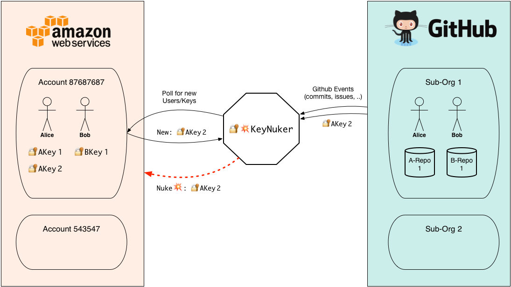
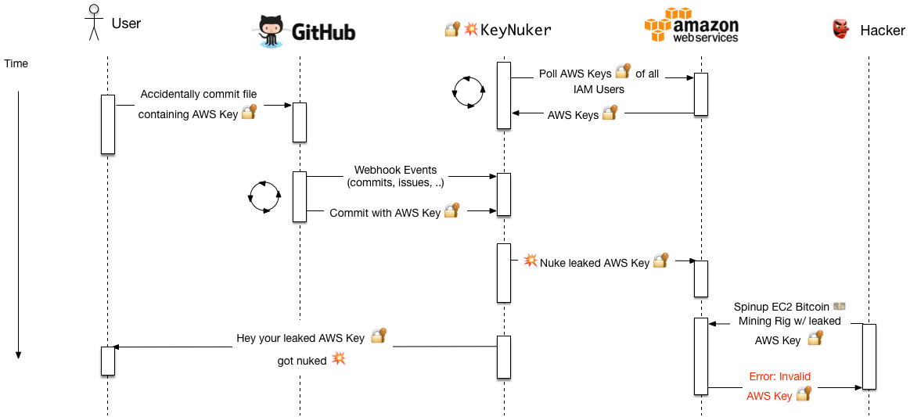

image:https://img.shields.io/badge/license-Apache%202-blue.svg[link=https://www.apache.org/licenses/LICENSE-2.0] image:https://badges.gitter.im/tleyden/keynuker.svg[link="https://gitter.im/tleyden/keynuker?utm_source=badge&utm_medium=badge&utm_campaign=pr-badge&utm_content=badge"]


If you accidentally leak your AWS keys on GitHub, it won't be long before attackers scrape this information and https://web.archive.org/web/20160304044323/https://www.forbes.com/sites/runasandvik/2014/01/14/attackers-scrape-github-for-cloud-service-credentials-hijack-account-to-mine-virtual-currency/#41d040f67cf8:[hijack your account for nefarious purposes].  

KeyNuker scans public activity across all Github users in your Github organization(s) and proactively deletes any AWS keys that are accidentally leaked.  It gets the list of AWS keys to scan by directly connecting to the AWS API.

== 🚁 System Overview

* Polling loop to monitor all AWS keys for users of the AWS account
* Polling loop to monitor Github activity of all users in your github organization(s)
* Reactively nuke any AWS keys detected to have leaked to Github via the AWS API



== ⏱ System Interaction w/ Timeline



== 🛠 Installing KeyNuker 🔐💥

KeyNuker is packaged as a series of https://github.com/apache/incubator-openwhisk[Apache OpenWhisk] actions, and can run anywhere that OpenWhisk can run.

Get the code:

```
$ go get -u -v -t github.com/tleyden/keynuker
```

Follow the steps in the link:docs/install.adoc[Installation Instructions] to setup OpenWhisk and set the required environment variables, and then run the installation script.

```
$ cd $GOPATH/src/github.com/tleyden/keynuker/
$ python install.py
```

After the installation script completes, you will have several OpenWhisk actions:

```
$ wsk action list
/yourusername_dev/github-user-events-scanner-nuker                     private sequence
/yourusername_dev/fetch-aws-keys-write-doc                             private sequence
etc ...
```

== ✅ Features

. Never has access to AWS Secret Access Keys, only to AWS Access Key IDs.
. Noise-free because it scans actual AWS keys rather than taking a pattern matching approach that produces false positives
. Takes actions rather than sending alerts, since depending on people to respond to alerts might introduce a costly delay in reaction time
. Covers all public github activity of users in your github org(s), since they might leak AWS keys on their personal repos or even 3rd party repos
. Requires minimal IAM Permissions: `iam:DeleteAccessKey`, `iam:ListAccessKeys`, `iam:ListUsers`
. Ultra-low baseline running cost due to serverless architecture
. Lowest common denominator and requires zero effort or workflow change for users

== ⚪️ Roadmap / Goals

. Low-latency round trip between AWS keys leaking and being nuked.  Currently uses polling approach, but the goal is to layer a webhook approach on top in order to lower the latency.
. Scale up to monitoring hundreds of AWS accounts and thousands of github organizations/repos/users.
. Cove as much of the Github API surface area as possible (gists, issue comments, etc)
. Pluggable architecture so that other cloud key providers (Google Cloud Platform, Azure, etc) and other leak sources (BitBucket, Jira, etc) can be added later.


== 🏁 Project status: Early alpha stage

The basic end-to-end functionality is working, except for notifications, but there are still a lot of places where AWS keys can leak to Github and go undetected:

 * Github Gists
 * Issue comments
 * Any push request with more than 20 commits will only result in the first 20 commits will be scanned, and the rest will be ignored.
 * Other Github API surface area that isn't covered yet


== 📓 Documentation

.Documentation
|===
|Doc |Link

|README (this document)
|link:README.adoc[README]

|Installation guide
|link:docs/install.adoc[Installation Instructions]

|Post-installation verification
|link:docs/verify.adoc[Verify Installation]

|Developer guide
|link:docs/developers.adoc[Developer guide]

|AWS Security Resources
|link:docs/aws_security_resources.adoc[AWS Security Resources]

|===


== 📰 Articles on malicious key scraping

* https://web.archive.org/web/20160304044323/https://www.forbes.com/sites/runasandvik/2014/01/14/attackers-scrape-github-for-cloud-service-credentials-hijack-account-to-mine-virtual-currency/#41d040f67cf8:[Attackers Scrape GitHub For Cloud Service Credentials, Hijack Account To Mine Virtual Currency]
* https://web.archive.org/web/20170111080816/http://www.itnews.com.au/news/aws-urges-developers-to-scrub-github-of-secret-keys-375785[AWS urges developers to scrub GitHub of secret keys]
* https://web.archive.org/web/20170205165621/https://www.theregister.co.uk/2015/01/06/dev_blunder_shows_github_crawling_with_keyslurping_bots/[Dev put AWS keys on Github. Then BAD THINGS happened]


== 📁 Related Projects

* https://github.com/awslabs/git-secrets[Git Secrets] -- Prevents you from committing secrets and credentials into git repositories
* https://github.com/ezekg/git-hound[Git Hound] --  Git plugin that helps prevent sensitive data from being committed into a repository by sniffing potential commits against PCRE regular expressions.
* https://github.com/michenriksen/gitrob[GitRob] -- Reconnaissance tool for GitHub organizations
* http://pre-commit.com/[pre-commit] - A pre-commit framework, that includes the http://pre-commit.com/hooks.html[detect-aws-credentials] plugin
* https://www.reddit.com/r/netsec/comments/5ll7ng/truffle_hog_a_tool_that_searches_entire_commit/[TruffleHog] -- A tool that Searches Entire Commit History in Git Repositories for High Entropy Strings to Find Secrets Accidentally Committed to Version Control
* https://rtyley.github.io/bfg-repo-cleaner/[BFG Repo cleaner] - Removes large or troublesome blobs like git-filter-branch does

== ⚙ Related Services

* https://www.gitguardian.com/[Git Guardian] -- Scanning service that alerts you of text strings that appear to be API keys (Github and more)
* https://github.com/cloudsploit[CloudSploit] -- Cloud security monitoring service / open source software which has a https://github.com/cloudsploit/scans/issues/10[feature request] very reminiscent of KeyNuker.
* https://evident.io/[Evident.io]
* https://dome9.com/iam-safety/[Dome9]
* https://www.cloudconformity.com[CloudConformity]


== 👀 Related Misc

* https://www.reddit.com/r/aws/comments/6pjf7n/we_got_hacked_looking_for_ideas_on_preventative/[reddit/aws: We got hacked. Looking for ideas on preventative measures going forward.]
* https://www.reddit.com/r/aws/comments/6onzgb/what_aws_security_compliances_do_you_guys_have/[reddit/aws: What AWS security compliances do you guys have for your environment?]

== 🔒 Security At Depth

Taking a security-at-depth approach, in addition to running KeyNuker you should also consider the following precautions:

- Limit ec2 actions to only the regions that you use, eg (`"StringEquals": {"ec2:Region": "us-east-1"}`)
- Limit ec2 actions to only the instance types that you use, eg (`"StringLikeIfExists": {"ec2:InstanceType": ["t1.*"]}`)
- Use temporary AWS keys that require MFA
- Minimize chance of AWS keys from ever leaking in the first place using tools such as https://github.com/awslabs/git-secrets[Git Secrets] which can be configured as a pre-commit hook.
